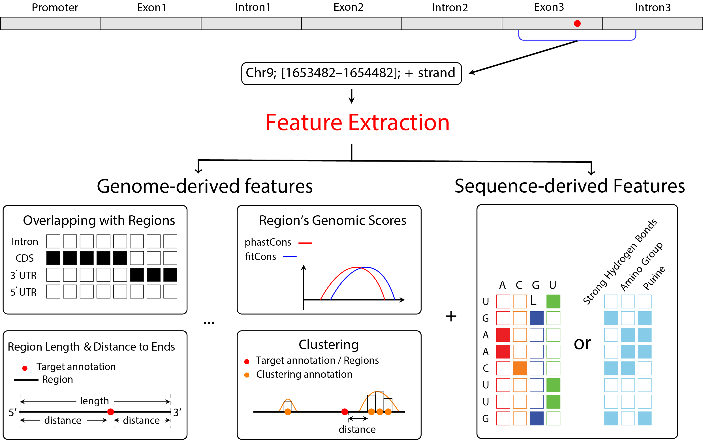

RPF Package Introduction
================
2021-06-11

# Introduction

**RPF** is a package for the extraction of comprehensive features on genomic intervals. A fundamental task in a genomic data science project is to extract informative genomic metrics that can predict quantities defined on range-based genomic annotations. In the past, the feature engineering tasks are often handled by a small number of handcrafted genome-derived features and sequence features. However, these methods cannot fully explore the interactive space between genomic regions and different genomic properties, such as the length and sequence contents.

The methods implemented in the RPF package can extract a wide range of properties defined on genomic regions, including length, sequence contents, genomic scores, clustering effects, distance toward the 5'/3' ends, and the relative positions of annotation on regions. When extracting genomic features with its main function, various genome properties are interactively extracted from the genomic regions of exons, introns, genes, transcripts, promoters, 5'UTR, 3'UTR, and CDS, establishing a large collection of genome-derived feature set. The input data for RPF are any target genome annotation stored in a Granges object. For example, the target can be intervals of peaks or sites obtained by high-throughput sequencing assays (such as par-CLIP, iCLIP, ChIP-Seq, and meRIP-Seq).

Another important question in the analysis of functional genomic data is to identify the genomic factors that are highly correlated to the target, as these factors may be causally linked to the measurement of interest. RPF can also offer a catalog of highly interpretive genomic & sequence features, which helps to identify the biologically meaningful factors through the feature importance analysis of the predictive models.

## Overview of functionalities

*RPF* provides fast and comprehensive feature extraction from the
range-based genome annotation; the extracted features can be used as the
input for a variety of modeling purposes such as supervised predictive
modeling and unsupervised factor analysis. The target range-based
annotation should be stored in *GRanges* object, which can be created
using the constructor function defined in the *GenomicFeatures* package.
Alternatively, the *GRanges* can be imported from the external
annotation files in **BED**, **GFF**, or **GTF** formats using the
`import` function defined in *dplyr* package.

There are 2 types of genomic features implemented in *RPF*: the
region properties features, and the sequence-derived features. The
former is extracted using an interactive design between the genomic
properties and the genomic regions, the latter is the sequence-derived
features extracted from the sequences of the flanking regions of the
annotation. When extracting the sequence-derived features, different
encoding methods can be specified, such as the one-hot method or the
pseudo nucleotide composition method.

<div class="figure" style="text-align: left">



<p class="caption">

Feature extraction framework of RPF

</p>

</div>

## Download

Installation from github can be initiated with the following command:

``` r
devtools::install_github("zw-xjtlu/RPF")
```

## Quick start

Here we demonstrate the most basic function of gnomic feature extraction. There are variety of bioconductor objects that are necessary to provide annotations if the corresponding property types are required, which we will display in the section bellow. The code chunk below assumes you have a GRanges for your target genomic intervals called `grg`. The `txdb` is a TxDb object for the transcript annotation, here we should use the annotation from the same genome assembly of `grg`. The `bsgemone` and `phastcons` are the reference genome and genome conservation scores, respectively. 


```{r, echo=FALSE, message=FALSE, warning=FALSE}
library(RPF)
library(TxDb.Hsapiens.UCSC.hg19.knownGene)
library(BSgenome.Hsapiens.UCSC.hg19)
library(phastCons100way.UCSC.hg19)

txdb <- TxDb.Hsapiens.UCSC.hg19.knownGene #Transcript annotation
bsgenome <- BSgenome.Hsapiens.UCSC.hg19 #Reference genome
phastcons <- phastCons100way.UCSC.hg19 #Conservation score

set.seed(737)
grg <- GRanges(seqnames = rep(c("chr1", "chr2"), c(5, 15)),
                           ranges = IRanges(c(sample(11874:12127, 5), 
                                                            sample(38814:41527, 15)), 
                                                         width=1),
                           strand = Rle(c("+", "-"), c(5, 15)))
              
gfeatures <- genomeDerivedFeatures(x = grg,
                                                             transcriptdb = txdb,
                                                             sequence = bsgenome,
                                                             gscores = phastcons)
str(gfeatures) #Display the columns (features)
```

## Complete User's Guide

For getting more information about the usage of RPF, enter the following R command after installation to view the instruction file:

``` r
RPF::RPFUsersGuide()
```

